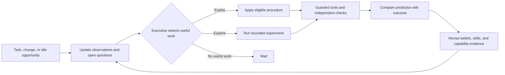

# From the fixture to an environment-specific colleague

The next meaningful milestone is an assistant that learns this repository and its Linear project, discovers useful gaps without a failing task, and demonstrably uses that learning on later work. A larger chat interface would not establish this capability.

This document is our engineering proposal. The observatory implements the visibility layer; the roadmap below is not implemented.

## What exists today

Pi calls Fireworks GLM 5.3 Flash, proposes tools, edits a disposable JavaScript function, and receives real tool results. The supervisor enforces a small action policy, chooses diagnosis after verification fails, and saves a verified contract field across fresh processes. The browser exposes actual events, code changes, expected and returned payloads, model messages, application prompts, and memory before and after a run.

The scope is deliberately small: one task family, one retained procedure, fixed goal scores, explicit destination preferences, no background work, and no autonomous discovery. The earlier live comparison passed all eight tasks but did **not** show an overall efficiency improvement. Neither passing this fixture nor displaying more traces establishes useful lifelong learning.

## Sophia coverage map

[Sophia, §§3–4](https://arxiv.org/html/2512.18202v1#S3) motivates episodic memory, theory of mind, metacognition, and intrinsic motivation. Its executive combines thought search, process supervision, and reflection with memory, user/self models, and hybrid rewards. The architecture discusses curiosity, mastery, coherence, relatedness, autonomous goals, and forward/backward learning. The pilot used inference-time memory without runtime weight updates (§5.1.2).

The following implementation choices and acceptance tests are ours:

| Area | Current implementation | Proposed next implementation |
| --- | --- | --- |
| Perception and action | Four authorized fixture tools and a forbidden-action probe | Typed observations and scoped tools for repository files, CI, and the project tracker; preserve source/version/time. Add media inputs only for an actual workflow. |
| Deliberate planning | One Pi model session per bounded task | Structured candidate plans with predicted outcomes, required evidence, and stopping conditions. |
| Executive and thought search | Fixed choice between task, diagnosis, and stop | Durable goal queue; bounded candidate search when ordinary execution fails. Store alternatives and selection criteria. |
| Process supervision | Deterministic tool and argument checks | Critique candidate plans for unsupported assumptions; retain deterministic authorization outside the model. A favorable critique cannot grant permission. |
| Reflection | Verification changes capability and procedure state | Compare a recorded prediction with the measured outcome; propose a versioned procedure patch; validate before promotion. |
| Episodic memory and identity | Bounded episode summaries, stable creed, complete run artifacts | Searchable experience records and linked evidence, stable agent ID, inspectable history across restarts. |
| User model and cooperation | An explicit destination preference | Editable goals, communication preferences, authority, and working agreements; distinguish statements from tentative inferences. |
| Self-model | One observed capability flag | Capability records scoped to task type and environment version, with successes, failures, uncertainty, and unsupported areas. |
| Curiosity and mastery | Failure triggers diagnosis | A queue of useful unknowns and experiments; progressively harder practice that must transfer to held-out work. |
| Coherence, relatedness, autonomy | Hard action policy and task budgets | Consistency with user goals and constraints; reward useful, timely collaboration rather than unsolicited engagement. Self-initiate only inside a defined role. |
| Hybrid reward | Handwritten `0.7 / 0.3` weights | Separate measured task value, information gain, competence gain, and resource cost. Calibrate goal valuation against later outcomes. |
| Forward/backward learning | Verified prompt memory, no weight changes | First improve retrieval and procedures. Consider offline training only after repeated failures remain despite good context and evidence. |

## The curiosity loop we should build

An unknown deserves exploration when knowing the answer can change a useful decision. Novelty alone is inadequate: a random page can be surprising forever without helping the assistant perform its job.

Represent each proposed experiment as a small record:

```json
{
  "question": "Does the documented release check still work?",
  "trigger": "README command disagrees with current CI configuration",
  "source_refs": ["README.md@commit", "tests.yml@commit"],
  "hypotheses": ["documentation is stale", "CI omits a required check"],
  "future_use": "release preparation",
  "experiment": "run both commands in an isolated checkout",
  "prediction": "the README command fails before running tests",
  "verification": "exit codes, executed test inventory, and logs",
  "limits": { "max_minutes": 3, "max_model_calls": 4 },
  "stop_when": "evidence separates the hypotheses or the budget is exhausted"
}
```

These numbers are an example experiment budget, not an enabled background configuration.

1. **Notice a gap.** Compare documents with observed behavior, detect contradictory sources, expired procedures, missing preconditions, or an untested capability. Deduplicate questions and record why the gap matters. A new user task is not required.
2. **Choose worthwhile learning.** Reject experiments outside authority first. Rank the remaining candidates by expected task benefit plus information and competence gain, minus time, monetary cost, and operational risk. Show the component estimates and uncertainty; do not label guessed scores as measured facts.
3. **Run the smallest discriminating experiment.** Read one authoritative source, compare two hypotheses, or rehearse a procedure in a disposable environment. User work can interrupt it. Repeated inconclusive experiments trigger a cooldown or an explicit unresolved status.
4. **Check what changed.** Compare the prior prediction with observations. An agent-written success claim is not evidence. Link any new belief to source observations, update its confidence and validity scope, and preserve counterexamples.
5. **Test transfer.** When a later task uses the result, record its outcome and cost. Close the credit-assignment loop: did this exploration help, hurt, or go unused? Reduce priority for categories of exploration that repeatedly fail to help.

Use explicit, inspectable estimates first. Learn ranking or exploration weights from enough outcome data to evaluate them against a fixed baseline. A contextual bandit is a possible later choice, not a dependency needed for the first experiment. Novelty, confidence reduction, and useful transfer should remain separately visible so one cannot hide failure in the others.

## Exploration versus exploitation

**Exploitation** applies an eligible, verified procedure to current work, checking that its preconditions still hold. **Exploration** spends a bounded amount of effort to answer an unknown that can improve future work. Both feed the same memory and evidence system.

The executive should wake on a user task, an environment event, a scheduled review, or an idle-learning opportunity. It should not poll the model endlessly. Each wake selects among authorized tasks, learning candidates, consolidation, or waiting.



Start with one worker, durable SQLite records, and a persisted queue. Track leased/running/completed states, action IDs, checkpoints, and costs. Recovery must distinguish “not attempted” from “may have executed”; a restart must not repeat an external write without checking its receipt. Add parallel workers only when independent work demonstrably needs them.

User deadlines and approved spending constrain exploration. Reserve a configurable share of the daily budget for learning, return it when urgent work arrives, and stop when there are no sufficiently valuable candidates. Constant adaptation means sustained responsiveness over time; it does not require constant token consumption.

## Memory that can change its mind

Keep experiences, beliefs, procedures, preferences, and capability measurements distinct. A tool result is an observation; an interpretation is a belief; a successful, reusable sequence is a candidate procedure. These deserve different validation and expiration rules.

Every reusable item needs its source events, environment/version scope, preconditions, last check, contradictory evidence, and replacement history. Search concise summaries first, retrieve raw evidence when needed, and measure retrieval failures before adding embeddings or a graph database. A renamed tool or changed contract should invalidate affected procedures through their dependencies.

Reflection should produce a proposed change with supporting and opposing evidence. Test that change on both a new case and an older case before promotion. This protects against memorizing the latest incident while breaking previously working behavior. Retain failed experiments as evidence about what remains unknown.

The user model should describe working arrangements the user can inspect and correct. For example: preferred depth of updates, current objectives, known constraints, and when publication needs approval. Do not turn guesses about emotions or intentions into facts. Relatedness should mean dependable collaboration and reduced unnecessary interruption, not maximizing conversations.

Keep authority and the immutable action policy outside learned memories. Improving a procedure must never expand the assistant's permissions.

## Delivery sequence and evidence gates

| Stage | Concrete deliverable | Gate before expansion |
| --- | --- | --- |
| 1. One useful environment | Repo + Linear inventory, read-only onboarding, source-linked answers, task and capability catalog | Answer a held-out set of environment questions with correct evidence; reject unsupported answers. Establish baseline task cost and accuracy. |
| 2. Curiosity vertical slice | Detect a documentation/CI contradiction, create a learning goal without a user request, rehearse in isolation, save the result | The trace shows the unknown, alternatives, prediction, budget, observation, and justified memory update. A later held-out task benefits. |
| 3. Persistent operation | Durable queue, interrupt/resume, restart recovery, daily budget, pause control, memory review | Interrupt and restart during each action boundary; demonstrate no duplicate external writes and no lost task state. |
| 4. Wider competence | Bounded plan search, calibrated capability/user models, versioned procedures, adaptive exploration ranking | Better measured outcomes across changed tools, priorities, and preferences; no regression on previously solved tasks. |
| 5. Employee-like responsibility | A narrow owned workflow such as release preparation or project triage, with explicit write permissions and review gates | Multi-day runs demonstrate useful completed work, accountable interventions, bounded cost, and recovery from real drift. |

The strongest next demo is stage 2: the assistant notices a real contradiction, investigates during idle time, updates a supported belief, and later completes work better because of it. That establishes proactive curiosity much more clearly than another predetermined repair scenario.

## How to establish improvement

Compare plain Pi, Pi with memory, Pi with memory and an executive, and the same system with curiosity enabled. Hold model, tool permissions, evaluation tasks, and total cost budgets constant. Include exploration cost in the comparison, even if it happened the previous day.

Measure task completion and quality, time to recover from drift, useful information per dollar, procedure reuse and regressions, prediction calibration, unwanted interruptions, and policy violations. Use multiple independent runs with held-out scenarios and uncertainty intervals. Include negative controls: irrelevant novelty, inconsistent sources, misleading instructions inside documents, unusable tools, interrupted writes, and insufficient evidence.

Do not use the number of self-generated goals, stored memories, “reflection” tokens, or novel pages visited as the primary success metric. They can all increase while the assistant becomes less useful.

## Observatory extensions accompanying that work

Add an experiment view showing open questions, candidate rankings, predictions versus results, and downstream benefit. Add inspectable environment/user/capability records with correction history. Connect a goal to its authorized actions, evidence, costs, procedure changes, and later reuse.

Record explicit plan summaries and decision fields emitted by the application; do not invent or reconstruct private model reasoning. The event inspector should always distinguish an observation, a hypothesis, a policy rule, and a measured outcome.

## References

- [Sophia: A Persistent Agent Framework of Artificial Life](https://arxiv.org/html/2512.18202v1) — research motivation and mechanism names; see §§3.1, 4.1.3, 4.2, 5.1.2, and 5.3.2. Our proposed scoring, budgets, sequence, and tests above are engineering choices, not reproduced experimental findings.
- [Current runtime and limits](pi-system3.md) — what this repository actually runs.
- [Sprint 1 scope and original diagrams](pi-system3-sprint-1.md) — the smaller fixture milestone.
- [React component design](https://react.dev/learn/thinking-in-react), [Vite build tooling](https://vite.dev/guide/), [server-sent events](https://developer.mozilla.org/en-US/docs/Web/API/Server-sent_events/Using_server-sent_events) — frontend implementation references.
